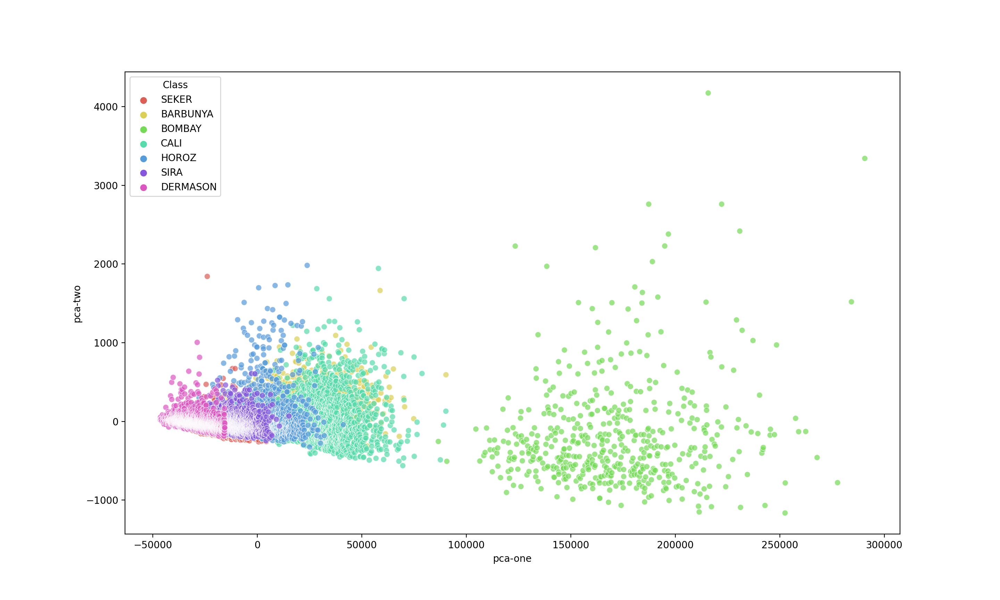
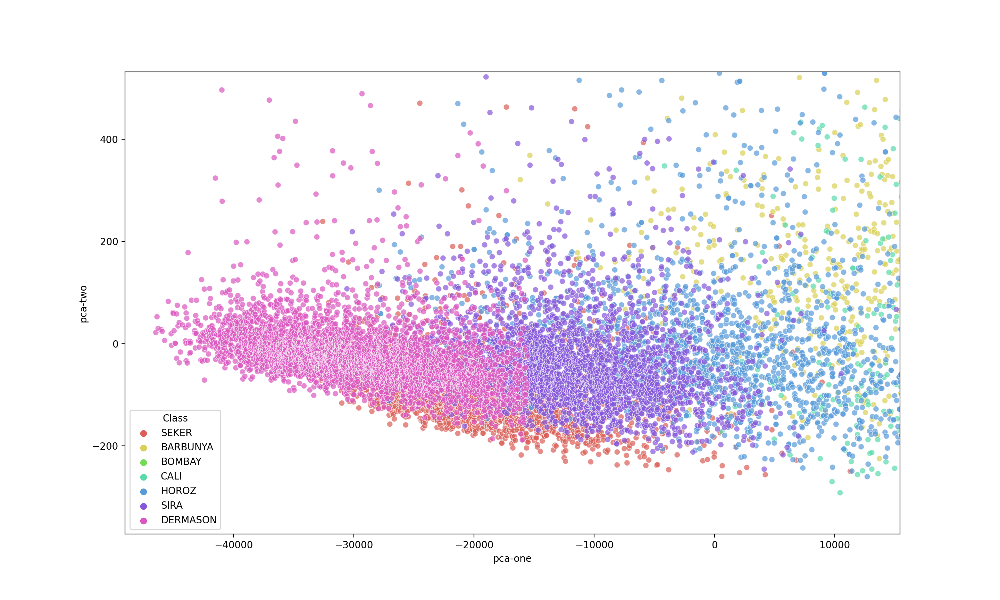
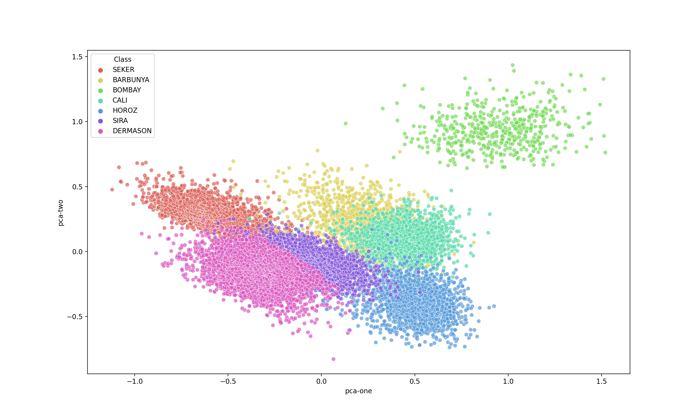
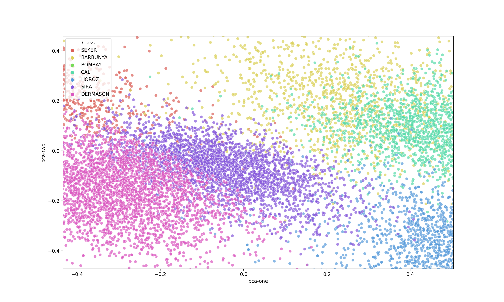
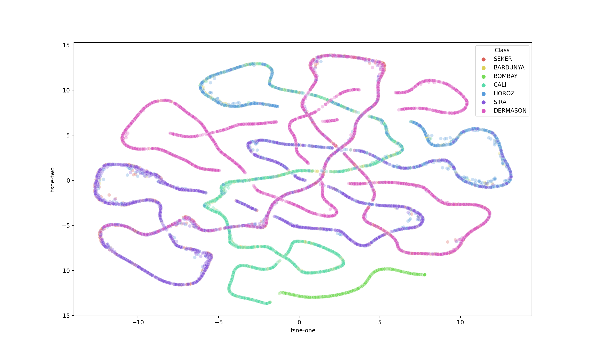
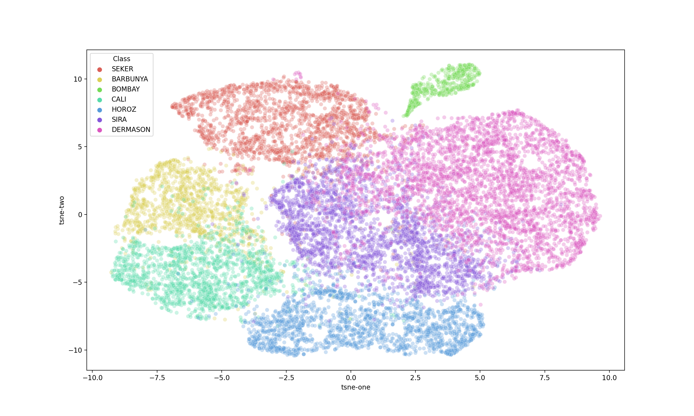

This project is dedicated to show influence of scaling. Dataset (Dry bean) is taking from [here](https://archive.ics.uci.edu/ml/datasets/Dry+Bean+Dataset).

# Figure from PCA with raw data

## Zoomed

# Figure from PCA with scaled data

## Zoomed

# Figure from t-SNE with raw data

# Figure from t-SNE with scaled data

